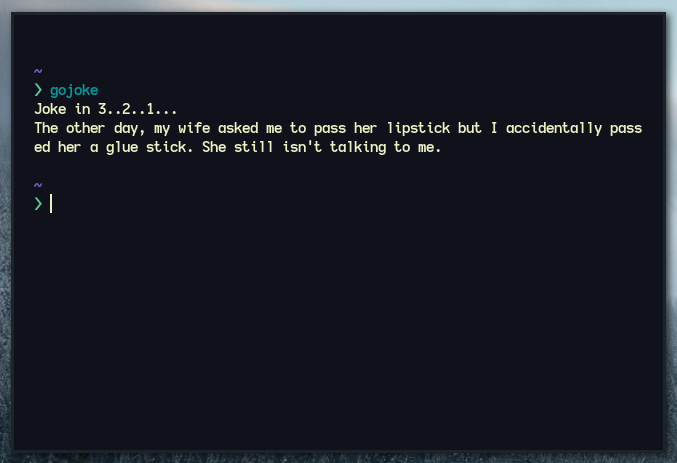

<div align=center>
    <h1>gojoke - jokes on the terminal using go!</h1>
</div>

# Screenshot

<div align=center>
    
</div>

# Usage

- First get the executable from releases or you can clone the source code
  and get the executable.

- Then copy the binary executable to your local bin path which will be `/home/{username}/.local/bin/` and then paste it there.

```bash
    $ cp -r ~/Downloads/gojoke ~/.local/bin/gojoke
```

- Now if you don't have the local bin as your executable path for your shell, you need to export it for the shell to be able to execute the binary.

- Check which shell you are using and add the command to their rc files:

- for bash, use `~/.bashrc`,

```bash
    $ export PATH=~/.local/bin:$PATH
```

- for zsh, use `~/.zshrc`,

```zsh
    $ export PATH=~/.local/bin:$PATH
```

- for fish, use `~/.config/fish/config.fish`,

```bash
    $ set -gx PATH ~/.local/bin:$PATH
```

- Then source the config file and run `gojoke`.
